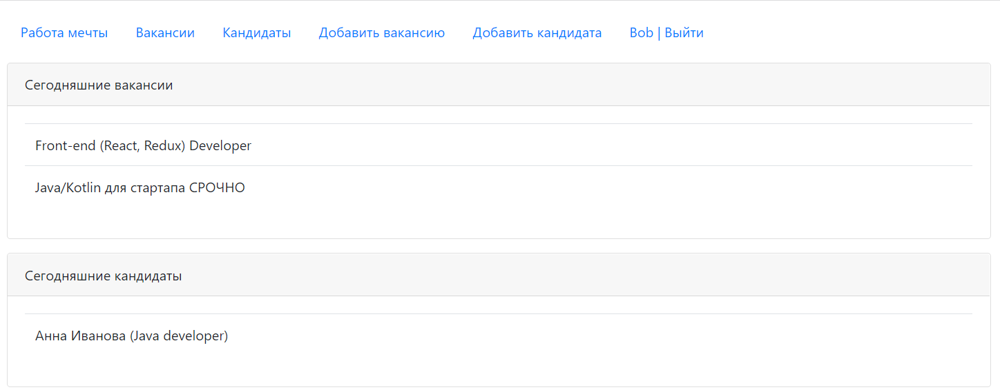
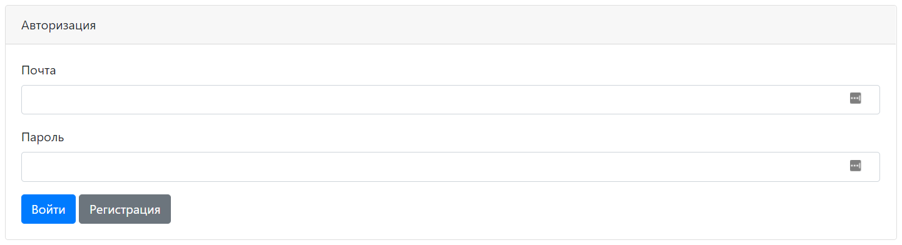
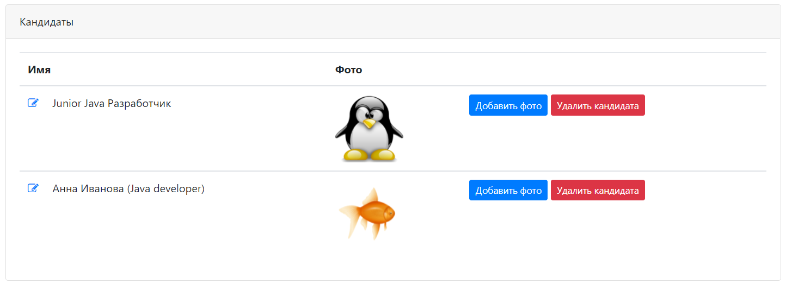
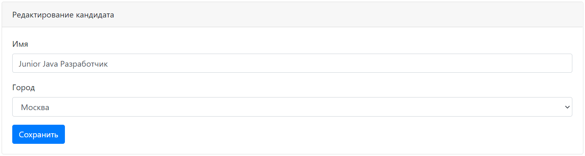

# job4j_dreamjob

Учебный мини-проект в рамках курса [job4j](https://job4j.ru/)  
Технологии: Java 15, Servlets, JSP, Postgres, Liquibase, Bootstrap 4, JQuery, Ajax
Реализованные возможности:
- Регистрация пользователя
- Создание/редактирование вакансии/кандидата
- Загрузка файлов на сервер

